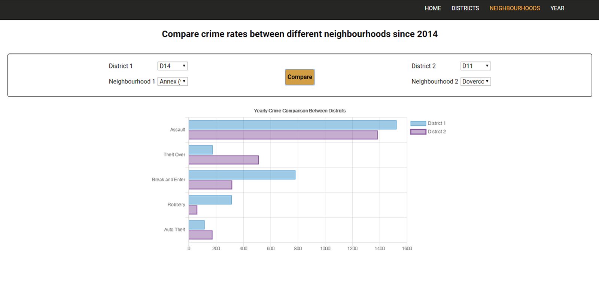

# UFT-Project-1: Is your Neighborhood Safe

**Project 1 for University of Toronto coding Bootcamp.**

**Live Demo:** https://andydurette.github.io/Toronto-Neighborhood-Safety/ 

**API Data Provided from:** http://data.torontopolice.on.ca/pages/open-data 

**Original Repo:** https://github.com/andydurette/UFT-Project-1 

**Project Details**
This project was made with one thing in mind how safe are Toronto neighbourhoods, it's not easy to answer as what quantifies safe in the first place? I though to take a few different approaches on how to question this question with the toronto Police's open crime Data which details all the crime in toronto by police district.

1. By comparing different police districts to each other via google maps.
2. Comparing different neighboods in Toronto to each other.
3. By comparing the same neigbourhood year to year.

The hope of the project is to provide the end user with the insight into how best to go about being aware of crime. The user could use it to better protect themselves or move out of a worsening neighbourhood.

